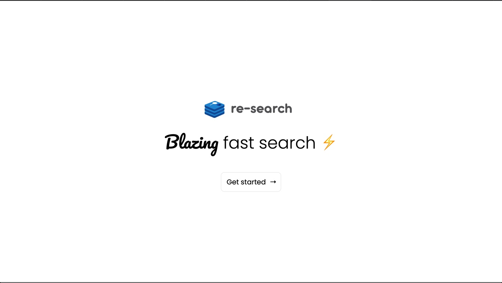
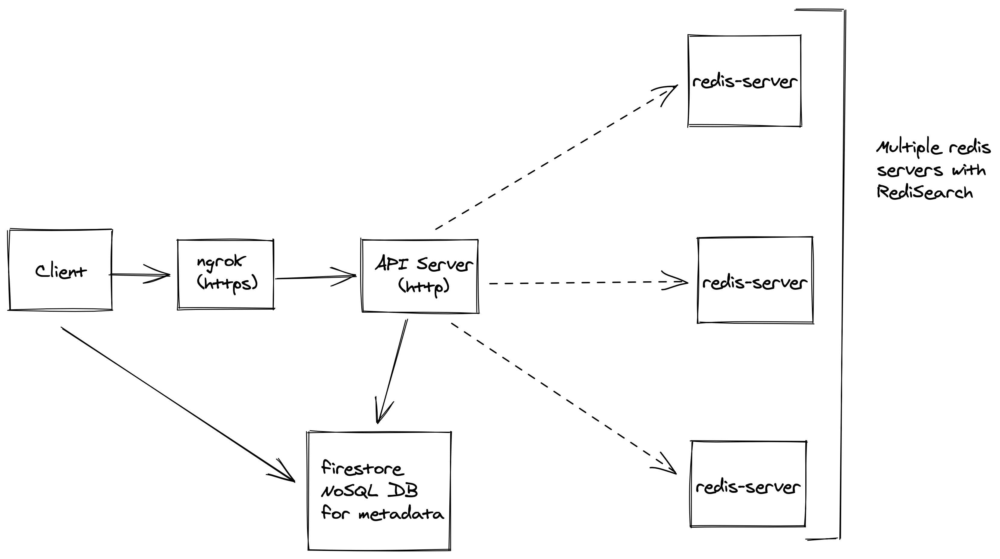

# re-search ⚡️

Blazing fast search API built on top of redis



[Youtube Demo](https://youtu.be/M3MjVthRYKo)

## How it works?

### Abstract

Developers can create projects launch their managed redis instances on GCE by choosing a region which serves them best. ([List of regions](#list-of-regions))

Once the project is created, developers can create indices and add relevant data for searching.

To add data to the index, devs are given an ```admin-api-key``` which is used to add and remove data, and alter configuration of an index.
A ```search-only-api-key``` is also provided which the devs should on the client side of their applications to search.

More detailed documentation can be found [here](DOCUMENTATION.md)

### Architecure Overview



## List of regions

| zone   | region  |
|:---:|:---:|
| asia-south1-a  | Mumbai  |
| asia-northeast1-a  | Tokyo  |
| asia-east2-a  | Hong Kong  |
| asia-northeast3-a  | Seoul  |
| australia-southeast1-b  | Sydney  |
| northamerica-northeast1-b  | Montreal, Canada  |
| us-central1-c  | Iowa  |
| us-east4-a  | Virginia  |
| us-west1-a  | Oregon  |
| europe-west3-b  | Frankfurt  |
| europe-west2-b  | London  |
| europe-north1-a  | Hamina, Finland  |
| europe-west1-b  | St. Ghislain, Belgium  |
| southamerica-east1-b  | Sao Paulo, Brazil  |

## Setup

```sh
npm install

# Add your API server url as NGROK_URL and your firebase credentials in a .env file

npm run dev
```
